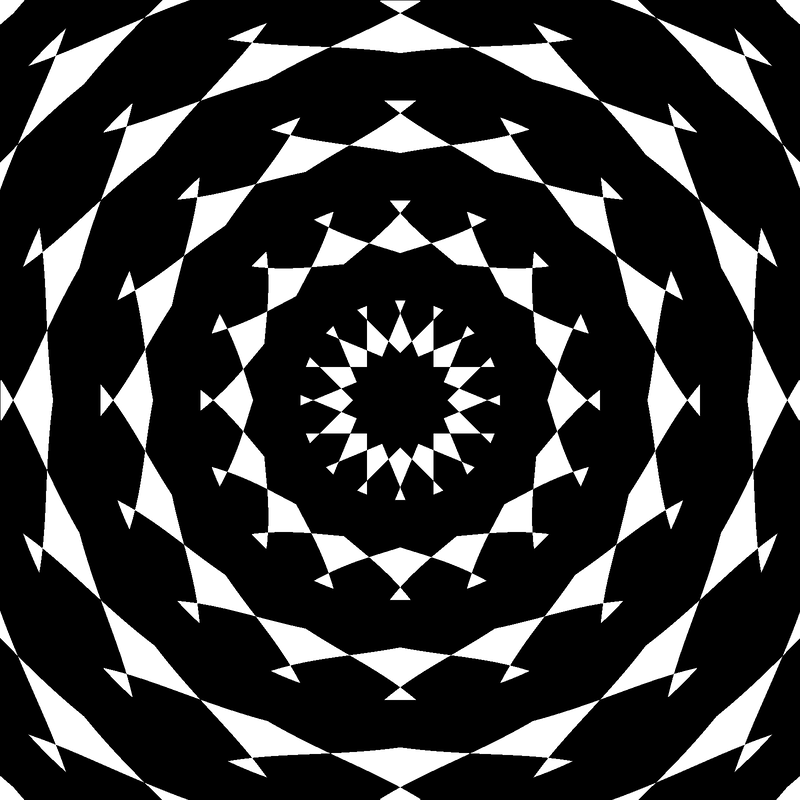
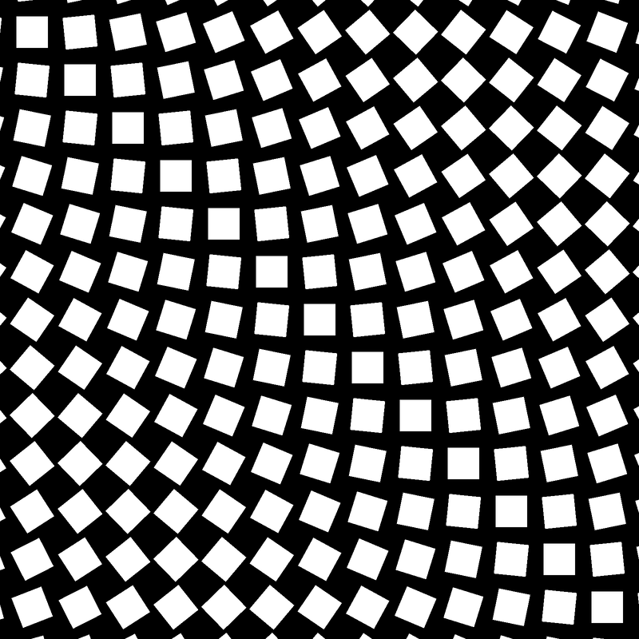
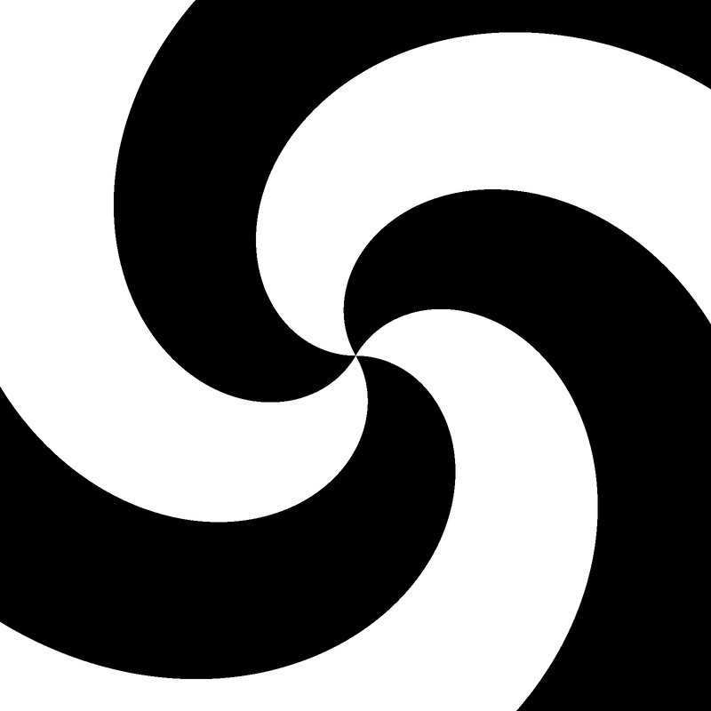
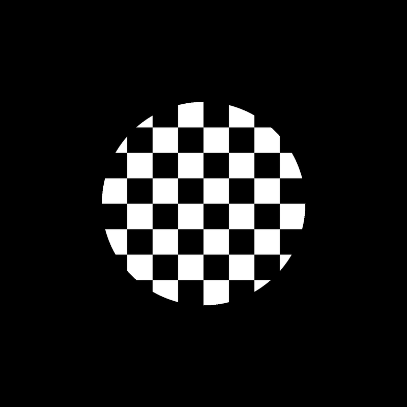

# Tegami

a naïve functional image generation library

## Features 

- written in Haskell
- pure definition of images
- inspired by *Conal Elliott's Pan* and *Jerzy Karczmarczuk's Clastic*
- incredibly slow
- incomplete
- inconsistent
- no documentation at all
- but hey, it's fun!

## Examples

